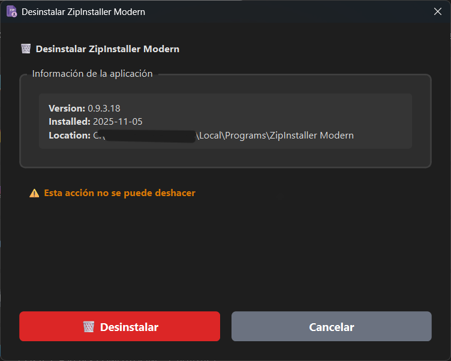

# ZipInstaller Modern (ZIM)


A lightweight, modern installer for portable Windows applications distributed as ZIP files. Inspired by NirSoft's ZipInstaller, built with Python and PySide6.
Supports Windows 10/11.

## 🎯 Features

### Core Functionality
- **📦 ZIP Installation**: Extract and install portable applications from ZIP archives
- **🗑️ Clean Uninstallation**: Complete removal with detection of user-created files
- **🔄 Self-Installation**: Install ZIM itself as a system application
- **📝 Registry Integration**: Full Windows Add/Remove Programs support
- **🎨 Modern UI**: Clean interface with automatic dark mode detection

### Smart Features
- **🔍 Intelligent Detection**: Automatically finds executables and reads metadata (version, publisher, icon)
- **📁 Flexible Structure**: Handles ZIPs with executables in root or first subdirectory
- **🖱️ Context Menu**: Right-click "Install with ZIM..." on ZIP files
- **⚡ Background Installation**: Non-blocking UI with progress feedback
- **🌐 Multilingual**: English and Spanish translations (easily extensible)

## 📸 Screenshots


*Main installation window with dark theme support*


*Uninstaller with additional files detection*

## 🚀 Quick Start

### Installation

1. **Download** the latest release from [Releases](https://github.com/yourusername/zipinstaller-modern/releases)
2. **Run** `ZIM.exe` (no installation required)
3. **Optional**: Install ZIM itself via the menu (☰) → "Install ZipInstaller Modern in the system"

### Usage

#### Installing an Application

1. Click **📂 Browse** and select a ZIP file
2. ZIM automatically detects executables and metadata
3. Configure name, installation path, and shortcuts
4. Click **⬇️ INSTALL**

#### Using Context Menu

1. Right-click any ZIP file in Explorer
2. Select **"Install with ZIM..."**
3. ZIM opens with the file pre-loaded

#### Uninstalling

- **Windows Settings** → Apps → Select application → Uninstall
- **Control Panel** → Programs and Features
- **Installation folder** → Run `uninstall.exe`

## 🛠️ Building from Source

### Prerequisites

```bash
# Python 3.12+
python --version

# Install dependencies
pip install -r requirements.txt
```

### Dependencies

- **PySide6** (GUI framework) - LGPL v3 / GPL v3
- **pywin32** (Windows integration) - PSF License
- **pefile** (Executable metadata) - MIT License
- **pyshortcuts** (Shortcut creation) - MIT License
- **Nuitka** (Python compiler) - Apache 2.0

### Compilation

```bash
# Using Nuitka (recommended)
nuitka --standalone --onefile --windows-console-mode=disable \
       --enable-plugin=pyside6 --msvc=latest \
       --file-version=1.0.0.0 --windows-icon-from-ico=zim.ico \
       --include-data-dir=locales=locales \
       --lto=yes --include-qt-plugins=sensible \
       --noinclude-qt-translations zim.py
```

### Project Structure

```
zipinstaller-modern/
├── zim.py              # Main application code
├── zim.ico             # Application icon
├── locales/            # Translation files
│   ├── xx/LC_MESSAGES/
├── requirements.txt    # Python dependencies
└── README.md           # This file
```

## 🌍 Translations

ZIM uses **Babel** for internationalization. Currently supported languages:

- 🇬🇧 English (default)
- 🇪🇸 Spanish

### Adding a New Language

1. Extract translatable strings:
```bash
pybabel extract -o messages.pot zim.py
```

2. Create translation for new language (e.g., French):
```bash
pybabel init -i messages.pot -d locales -l fr
```

3. Edit `locales/fr/LC_MESSAGES/messages.po`

4. Compile translations:
```bash
pybabel compile -d locales
```

## 📋 Technical Details

### How It Works

1. **ZIP Analysis**: Scans for `.exe` files in root or first subdirectory
2. **Metadata Extraction**: Uses `pefile` to read executable version info
3. **Installation**: 
   - Extracts files to `%LOCALAPPDATA%\Programs\AppName`
   - Creates `uninstall.exe` (copy of ZIM)
   - Saves `install_info.json` with file list
   - Generates desktop/Start Menu shortcuts
   - Registers in Windows Registry (HKCU\Software\Microsoft\Windows\CurrentVersion\Uninstall)

4. **Uninstallation**:
   - Detects additional files created after installation
   - Removes shortcuts and registry entries
   - Self-deletes via batch script

### Registry Keys

ZIM creates entries under:
```
HKEY_CURRENT_USER\SOFTWARE\Microsoft\Windows\CurrentVersion\Uninstall\[AppName]
```

Fields: `DisplayName`, `DisplayVersion`, `Publisher`, `InstallLocation`, `UninstallString`, `DisplayIcon`, `EstimatedSize`, `InstallDate`

### Context Menu Registration

For ZIP files, ZIM registers:
```
HKEY_CURRENT_USER\Software\Classes\[ProgID]\shell\InstallWithZIM\command
```

Where `[ProgID]` is detected from the system's ZIP file association.

## 🤝 Contributing

Contributions are welcome! Please feel free to submit issues, fork the repository, and create pull requests.

### Development Setup

1. Fork and clone the repository
2. Create a virtual environment:
```bash
python -m venv venv
venv\Scripts\activate  # Windows
```

3. Install dependencies:
```bash
pip install -r requirements.txt
```

4. Run from source:
```bash
python zim.py
```

### Code Style

- Follow PEP 8 guidelines
- Use type hints where applicable
- Add docstrings to all public functions/classes
- Keep functions focused and modular

## 📄 License

This project is licensed under the **GNU General Public License v3.0** (GPLv3).

See [LICENSE](LICENSE) for the full license text.

### Third-Party Licenses

- **PySide6**: LGPL v3 / GPL v3 / Commercial
- **pywin32**: Python Software Foundation License
- **pefile**: MIT License
- **pyshortcuts**: MIT License
- **Nuitka**: Apache License 2.0

All dependencies are compatible with GPLv3.

## ⚠️ Disclaimer

This software is provided "AS IS" without warranty of any kind. Use at your own risk. Always verify the contents of ZIP files before installation.

## 🙏 Acknowledgments

- Inspired by **NirSoft's ZipInstaller**
- Built with **PySide6** (Qt for Python)
- Compiled with **Nuitka**

## 📞 Contact

**Author**: VM/Studio

**Issues**: [GitHub Issues](https://github.com/yourusername/zipinstaller-modern/issues)

---

Made with ❤️ by VM/Studio
